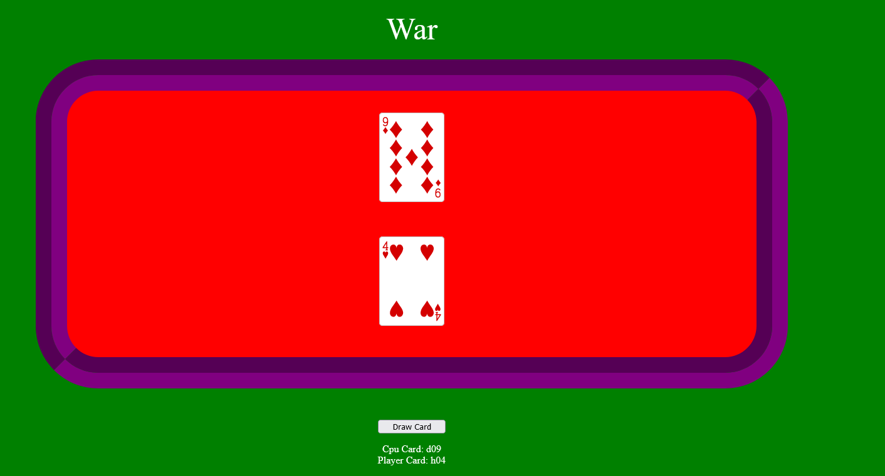

<div id="top"></div>
<!--
*** Thanks for checking out the Best-README-Template. If you have a suggestion
*** that would make this better, please fork the repo and create a pull request
*** or simply open an issue with the tag "enhancement".
*** Don't forget to give the project a star!
*** Thanks again! Now go create something AMAZING! :D
-->

<!-- PROJECT SHIELDS -->
<!--
*** I'm using markdown "reference style" links for readability.
*** Reference links are enclosed in brackets [ ] instead of parentheses ( ).
*** See the bottom of this document for the declaration of the reference variables
*** for contributors-url, forks-url, etc. This is an optional, concise syntax you may use.
*** https://www.markdownguide.org/basic-syntax/#reference-style-links
-->

<!-- PROJECT LOGO -->
<br />
<div align="center">
  <a href="https://github.com/DKotzer/card-games">
    
  </a>

<h3 align="center">Card Games</h3>

  <p align="center">
    First Project for General Assembly SEI .
    <br />
    <a href="https://github.com/DKotzer/card-games"><strong>Explore the docs »</strong></a>
    <br />
    <br />
    <!-- <a href="https://github.com/DKotzer/card-games">View Demo</a> -->
    ·
    <a href="https://github.com/DKotzer/card-games/issues">Report Bug</a>
    ·
    <a href="https://github.com/DKotzer/card-games/issues">Request Feature</a>
  </p>
</div>

<!-- ABOUT THE PROJECT -->

## About The Project

For my first project at my software engineering bootcamp I am making a collection of card games. I will start with War, Blackjack and Poker. After the boot camp I could potentially come back and add more games to the home page.

Oops after looking up the average number of turns for a game of war I realized that two equal cards isnt a draw but a 'war'.



### Installation

1. Clone the repo
   ```sh
   git clone git@github.com:DKotzer/card-games.git
   ```

<!-- USAGE EXAMPLES -->

## Usage

<!-- ROADMAP -->

## Roadmap

- [10%] Finish War
  - [ ] Finish War CSS
- [0%] Finish Blackjack
  - [0%] Finish BlackJack CSS
- [0%] Finish Poker JS
  - [0%] Finish Poker CSS
- [25%] Finish ReadMe

See the [open issues](https://github.com/DKotzer/card-games/issues) for a full list of proposed features (and known issues).

<!-- CONTRIBUTING -->

## Lessons Learned

- watch out for single = when checking if something is equal to something else. Check for this early on when troubleshooting
- it took me a while to figure out why some cards kept dissapearing from the decks.
<!-- CONTACT -->

## Contact

Dylan Kotzer - [@DylanKotzer](https://twitter.com/DylanKotzer) - dylanKotzer@gmail.com

Project Link: [https://github.com/DKotzer/card-games](https://github.com/DKotzer/card-games)

<!-- MARKDOWN LINKS & IMAGES -->
<!-- https://www.markdownguide.org/basic-syntax/#reference-style-links -->

[linkedin-url]: https://www.linkedin.com/in/dylan-kotzer-3a5421190/
[product-screenshot]: images/screenshot.png
