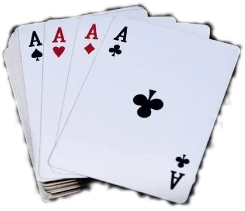
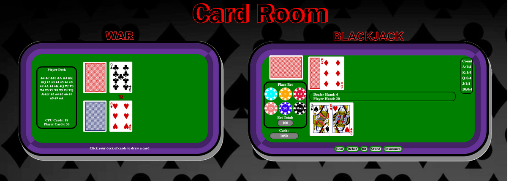
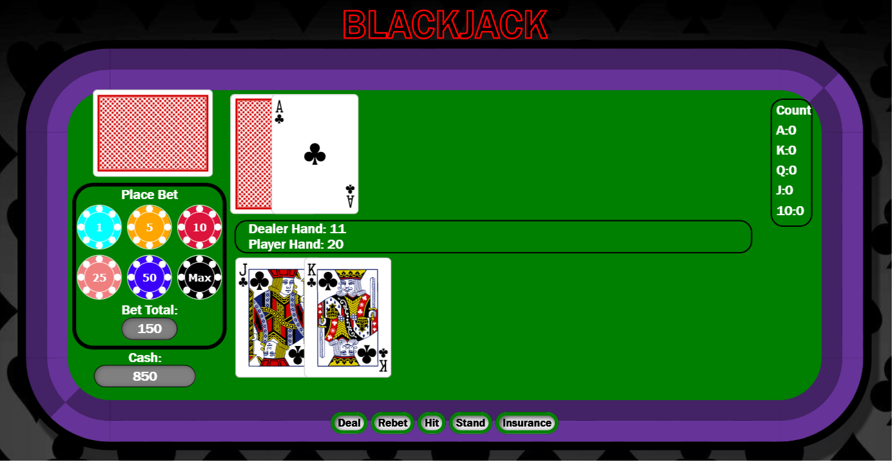
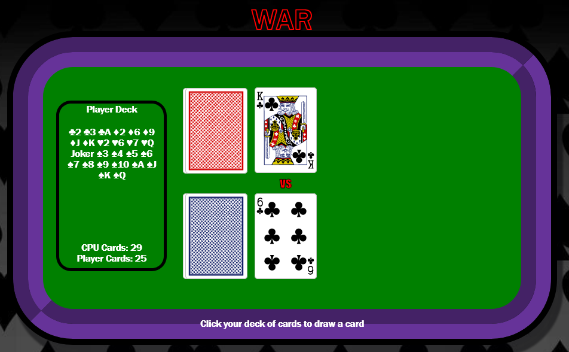

<br />
<div align="center">
  <a href="https://dkotzer.github.io/card-games/">
    
  </a>

<h1 align="center">Card Games</h3>

  <p align="center">
    First Project for General Assembly SEI .
    <br />
    <a href="https://github.com/DKotzer/card-games"><strong>Explore the docs »</strong></a>
    <br />
    <br />
    <!-- <a href="https://github.com/DKotzer/card-games">View Demo</a> -->
    ·
    <a href="https://github.com/DKotzer/card-games/issues">Report Bug</a>
    ·
    <a href="https://github.com/DKotzer/card-games/issues">Request Feature</a>
  </p>
</div>
<!-- ABOUT THE PROJECT -->
## General Overview

Card Games is a collection of card games.
You select which game you would like to play on the home page by clicking it. Currently there is only War and Blackjack.

You can play the game by clicking [here].


<br/><br/>

# BlackJack

The rules are simple, the play is thrilling, and there is opportunity for high strategy. If you can count cards it is one of the only casino games that is in the players favour.

But even for the casual participant who plays a reasonably good game, Blackjack is one of the most attractive casino games from an odds perspective.



This version of Blackjack has a card counting feature that allows you to practice your card counting skills. It also employs an insurance system if that dealer has Ace up on the flop - so you can incoproate that in to your practice as well.

## Object of the Game

The player attempts to beat the dealer by getting a count as close to 21 as possible, without going over 21.

## Turn structure

1. Player places bet by clicking chips
2. Player starts the hand by pressing Deal
3. Player can choose to hit as long as they are below 21
4. When player is done hitting they can hit press stand to end their turn
5. Dealer will then stay if over 16 or hit until they reach above 16.
6. Whoever comes closer to 21 without going over wins. If both dealer and player have the same hand value it is a push/draw.

example turns:

https://user-images.githubusercontent.com/34380246/155643322-248a41db-41ea-41e2-a31a-b9848a3c3e69.mp4

# WAR

The deck is divided evenly among the players, giving each a face down stack. In unison, each player reveals the top card of their deck—this is a "battle"—and the player with the higher card takes both of the cards played and moves them to their stack. Aces are high, and suits are ignored.



If the two cards played are of equal value, then there is a "war". Both players place the next three cards face down and then another card face-up. The winner of the war takes all the cards and puts them at the bottom of their deck.

https://user-images.githubusercontent.com/34380246/155637377-3293f8a0-4624-4023-8e3f-329c790b69ba.mp4

If the face-up cards are again equal then the war repeats with another set of face-down/up cards. This repeats until one player's face-up card is higher than their opponent's.

## Object of the Game

The objective of the game is to win all of the cards.

## Turn structure

1. Click the deck

#

## About The Project

For my first project at my software engineering bootcamp I am making a collection of card games. I will start with War, and Blackjack. After the boot camp I could potentially come back and add more games to the home page.

## Built With

- JavaScript
- HTML
- CSS

### Installation

If you prefer to install the game on your machine for offline play you can clone the repo using the below code in your terminal of choice:

```sh
git clone git@github.com:DKotzer/card-games.git
```

<!-- ROADMAP -->

## Roadmap

- [10%] Finish War
  - [ ] Finish War CSS
- [0%] Finish Blackjack
  - [0%] Finish BlackJack CSS
- [0%] Finish Poker JS
  - [0%] Finish Poker CSS
- [25%] Finish ReadMe

See the [open issues](https://github.com/DKotzer/card-games/issues) for a full list of proposed features (and known issues).

<!-- CONTRIBUTING -->

## Lessons Learned

- watch out for single = when checking if something is equal to something else. Check for this early on when troubleshooting
- it took me a while to figure out why some cards kept dissapearing from the decks.
<!-- CONTACT -->

## Contact

Dylan Kotzer - [@DylanKotzer](https://twitter.com/DylanKotzer) - dylanKotzer@gmail.com

Project Link: [https://github.com/DKotzer/card-games](https://github.com/DKotzer/card-games)

<!-- MARKDOWN LINKS & IMAGES -->
<!-- https://www.markdownguide.org/basic-syntax/#reference-style-links -->

[linkedin-url]: https://www.linkedin.com/in/dylan-kotzer-3a5421190/
[product-screenshot]: images/screenshot.png
[here]: https://dkotzer.github.io/card-games/
